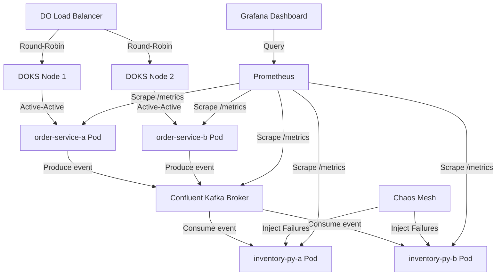

# Plan Overview: SRE Sandbox with ERP

This document outlines the high-level roadmap, current active track, and status of tasks for the SRE Sandbox with ERP.

## Architectural Diagram

## Requirements & Solutions

### Core Requirements
- **Active-Active REST Gateway**: Go `order-service` with anti-affinity running across multiple nodes.
- **Background Event Processing**: Python `inventory-service` consuming events via Kafka.
- **Chaos Resilience**: Pod eviction recovery, latency, and memory limit handling.
- **Full Observability**: Live Prometheus scraping and Grafana metrics dashboard.

### Implementation Goals
1. Implement clean REST API handlers in Go and structured event handlers in Python.
2. Ensure strict test-driven development (TDD) cycle for all components.
3. Package application components as microservice containers.
4. Establish local development environment via Docker Compose to validate flows before cloud deploy.

---

## Active Track: Implement Go Order and Python Inventory Services with Kafka Event Bus

Track ID: `core_services_20260620`
Status: `In Progress`

### Phase 1: Go Order Service
- [ ] Implement HTTP Endpoints and Basic Validation (TDD)
- [ ] Implement Kafka Producer (TDD)
- [ ] Add Observability and Docker Containerization
- [ ] Conductor - User Manual Verification 'Phase 1: Go Order Service'

### Phase 2: Python Inventory Service
- [ ] Implement Health Server and Metric Server (TDD)
- [ ] Implement Kafka Consumer and Event Handlers (TDD)
- [ ] Python Containerization
- [ ] Conductor - User Manual Verification 'Phase 2: Python Inventory Service'

### Phase 3: Integration and Docker Compose Local Sandbox
- [ ] Orchestrate Sandbox with Docker Compose
- [ ] End-to-End Pipeline Verification
- [ ] Conductor - User Manual Verification 'Phase 3: Integration and Docker Compose Local Sandbox'
