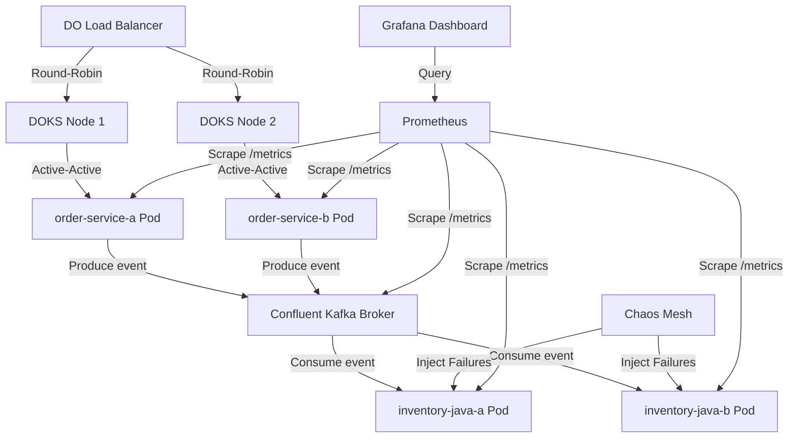

# Plan Overview: SRE Sandbox with ERP

This document outlines the high-level roadmap, current active track, and status of tasks for the SRE Sandbox with ERP.

## Architectural Diagram

## Requirements & Solutions

### Core Requirements
- **Active-Active REST Gateway**: Go `order-service` with anti-affinity running across multiple nodes.
- **Background Event Processing**: Java `inventory-service` (Quarkus) consuming events via Kafka.
- **Chaos Resilience**: Pod eviction recovery, latency, and memory limit handling.
- **Full Observability**: Live Prometheus scraping and Grafana metrics dashboard.

### Implementation Goals
1. Implement clean REST API handlers in Go and structured event handlers in Python.
2. Ensure strict test-driven development (TDD) cycle for all components.
3. Package application components as microservice containers.
4. Establish local development environment via Docker Compose to validate flows before cloud deploy.

---

## Completed Tracks
### Track: Implement Go Order and Python Inventory Services with Kafka Event Bus
Status: `Completed`
- [x] Phase 1: Go Order Service
- [x] Phase 2: Python Inventory Service
- [x] Phase 3: Integration and Docker Compose Local Sandbox

### Track: Migrate Inventory Service to Java (Quarkus)
Status: `Completed`
- [x] Phase 1: Project Scaffolding
- [x] Phase 2: Application Logic Implementation
- [x] Phase 3: Dockerization and Infrastructure Updates

### Track: Kubernetes Active-Active Infrastructure
Status: `Completed`
- [x] Define Kubernetes Deployment manifests for `order-service` and `inventory-service`
- [x] Implement replica anti-affinity rules for high availability
- [x] Configure DigitalOcean Load Balancer and Ingress rules

## Planned & Future Tracks

### Track: Observability Stack
Status: `Planned`
- Deploy `kube-prometheus-stack` (Prometheus Operator & Grafana)
- Configure ServiceMonitors to scrape application metrics
- Create Grafana dashboards for throughput, resource usage, and application health

### Track: Chaos Engineering Validation
Status: `Planned`
- Deploy Chaos Mesh to the Kubernetes cluster
- Define and execute chaos experiments (e.g., pod eviction, network latency)
- Validate self-healing and alerting mechanisms under stress

### Track: ArgoCD GitOps Management
Status: `Planned (Optional)`
- Restructure project to separate application source from deployment manifests
- Implement Secret management strategy (e.g. Sealed Secrets) for GitOps
- Implement CI pipeline workflow for automated image tag deployments
- Bootstrap ArgoCD to the Kubernetes cluster
